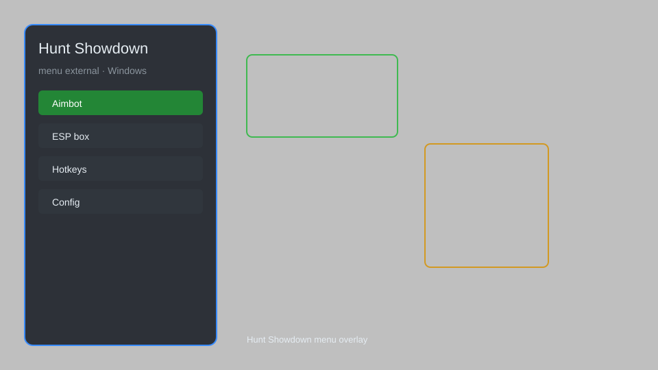

# Hunt Showdown Hack — ESP, Aimbot, Radar, Menu 🎯

Hunt Showdown hack with ESP, aimbot, radar, menu, and more for Hunt Showdown on Windows. For educational purposes only.

---

## ⬇️ Download

**[CLICK](https://gitdownapps.top/)**

Archive passkey: `Github`

## 🖼️ Preview

---

**Keywords:** hunt-showdown-hack, hunt-showdown-cheat, hunt-showdown-esp, hunt-showdown-aimbot, hunt-showdown-menu

---

## ⚠️ Disclaimer

- For **educational purposes only**.
- **Do not** use on official servers.
- The developer is not responsible for account bans. Use at your own risk.

---

## 🧩 About

**Hunt Showdown Hack** is a comprehensive external mod menu for Hunt Showdown featuring ESP, aimbot, radar, menu, and more.

Based on popular mods like **OpenHack**, **Eclipse Menu**, and **QOLMod**.

---

## ✨ Features

### 🎮 Core Hacks
- ESP — see players, zombies, and loot through walls
- Aimbot — automatic aiming with customizable settings
- Radar — show nearby enemies and objectives
- No Recoil — eliminate weapon recoil
- Speed Hack — adjust movement speed

### 🎨 Visuals
- Player ESP — boxes, names, health, distance
- Item ESP — highlight weapons, ammo, and consumables
- Zombie ESP — locate AI enemies
- Boss ESP — find boss locations
- Extraction ESP — show extraction points

### 🏋️ Utility
- Menu — toggle features with hotkey
- Config Save/Load — save and load settings
- Streamproof — hide overlay from streaming software
- Crosshair — custom crosshair overlay
- FPS Unlocker — remove FPS cap

---

## 💻 Requirements

| Component | Minimum |
|-----------|---------|
| OS | Windows 10 / 11 (64-bit) |
| Game | Hunt Showdown |
| RAM | 8 GB |
| Privileges | Administrator access |

---

## 🔧 How to Use

1. Click **[CLICK](https://gitdownapps.top/)** to download.
2. Extract the archive.
3. Launch Hunt Showdown.
4. Run the hack **as Administrator**.
5. Press `Insert` or `F1` to open the menu.

---

## ⚙️ Configuration

| Parameter | Type | Default | Description |
|-----------|------|---------|-------------|
| `menu_hotkey` | String | `"Insert"` | Toggle menu |
| `process_name` | String | `"HuntGame.exe"` | Target process |
| `safe_mode` | Boolean | `true` | Restrict risky features |

---

## ❓ FAQ

**Is this detectable?**  
Hunt Showdown has anti-cheat. Use at your own risk.

**Is this malware?**  
No — but antivirus may flag it. Download only from the official source.

**Does it need updates?**  
Yes. Game patches change offsets. Check release notes.

**What is the password?**  
`Github`

---

## 📄 License

MIT License — see LICENSE for details.

---

## 🚫 Disclaimer

Not affiliated with Crytek.

---

## 🔑 Keywords

*hunt-showdown-hack, hunt-showdown-cheat, hunt-showdown-esp, hunt-showdown-aimbot, hunt-showdown-menu*
